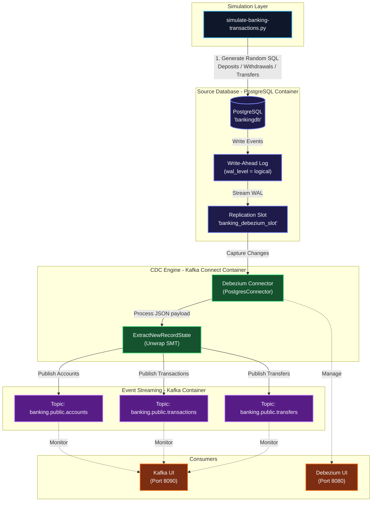

# Banking CDC Pipeline Architecture

```mermaid
graph TD
    %% Styling
    classDef default fill:#1e1e24,stroke:#3a3a4a,stroke-width:1px,color:#d4d4d8;
    classDef simulator fill:#0f172a,stroke:#38bdf8,stroke-width:2px,color:#f8fafc;
    classDef database fill:#1e1b4b,stroke:#818cf8,stroke-width:2px,color:#f8fafc;
    classDef connect fill:#14532d,stroke:#4ade80,stroke-width:2px,color:#f8fafc;
    classDef stream fill:#581c87,stroke:#c084fc,stroke-width:2px,color:#f8fafc;
    classDef consumer fill:#7c2d12,stroke:#f97316,stroke-width:2px,color:#f8fafc;

    subgraph Simulation [Simulation Layer]
        SIM["simulate-banking-transactions.py"]:::simulator
    end

    subgraph Storage [Source Database - PostgreSQL Container]
        DB[("PostgreSQL <br/> 'bankingdb'")]:::database
        WAL["Write-Ahead Log <br/> (wal_level = logical)"]:::database
        SLOT["Replication Slot <br/> 'banking_debezium_slot'"]:::database
        
        DB -->|Write Events| WAL
        WAL -->|Stream WAL| SLOT
    end

    subgraph CDC [CDC Engine - Kafka Connect Container]
        DEB["Debezium Connector <br/> (PostgresConnector)"]:::connect
        UNWRAP["ExtractNewRecordState <br/> (Unwrap SMT)"]:::connect
        
        SLOT -->|Capture Changes| DEB
        DEB -->|Process JSON payload| UNWRAP
    end

    subgraph Streaming [Event Streaming - Kafka Container]
        TOPIC_ACC["Topic: banking.public.accounts"]:::stream
        TOPIC_TX["Topic: banking.public.transactions"]:::stream
        TOPIC_TR["Topic: banking.public.transfers"]:::stream
        
        UNWRAP -->|Publish Accounts| TOPIC_ACC
        UNWRAP -->|Publish Transactions| TOPIC_TX
        UNWRAP -->|Publish Transfers| TOPIC_TR
    end

    subgraph Monitoring [Consumers]
        KUI["Kafka UI <br/> (Port 8090)"]:::consumer
        DUI["Debezium UI <br/> (Port 8080)"]:::consumer
        
        TOPIC_ACC -.->|Monitor| KUI
        TOPIC_TX -.->|Monitor| KUI
        TOPIC_TR -.->|Monitor| KUI
        DEB -.->|Manage| DUI
    end

    %% Interactions
    SIM -->|1. Generate Random SQL Deposits / Withdrawals / Transfers| DB
```
